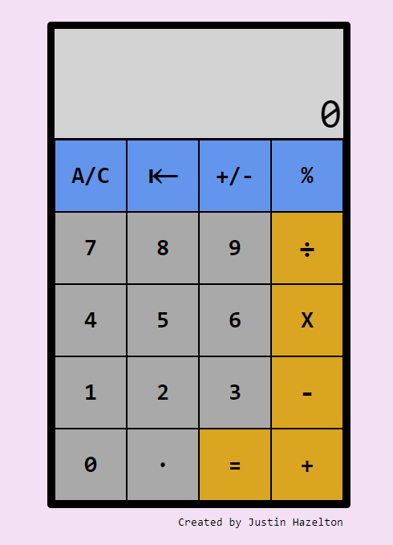

Demo: https://j-haze.github.io/calculator/

## Calculator
Calculator App using JavaScript.

🔗 **Live preview** of the app is [here](https://j-haze.github.io/calculator/).

### Purpose: ###
The purpose of this project was to create a functional calculator app, while allowing me to practice and expand upon my knowledge of JavaScript.

### Demonstrated Knowledge Of: ###

HTML, CSS, JavaScript

### Notable Features: ###

* Basic Calculator Functions
** Add, Subtract, Multiply, Divide, 
* Change drawing mode between solid and gradient.
* Erase specific squares or clear the whole board.

### My web toy in action: ###

